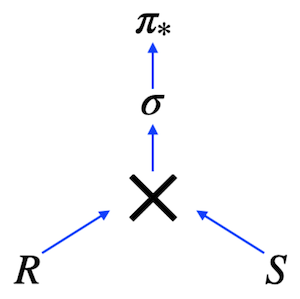

# D02 SQL 

## Theory

The image shows a Relational Expression in Tree View. This expression corresponds to the following SQL query:

    SELECT *
        FROM R CROSS JOIN S
    WHERE clause

In other words, we can describe any SQL in the mathematical language of Relational Algebra.

The main question (that we hear from our students) is why do we need to learn Relational Algebra in a course if we can write a SQL in the first attempt? My answer is yes and no at the same time. "Yes" means that you can write a SQL from the first attempt, that's right, "No" means that you need to know the main aspects of Relational Algebra, because this knowledge is used for optimization plans and for semantic queries. 
What kind of joins exist in Relational Algebra?
Actually, "Cross Join" is a primitive operator and it is an ancestor for other types of joins.
- Natural Join,
- Theta Join,
- Semi Join,
- Anti Join,
- Left/Right/Full Joins. 

But what is a join operation between 2 tables? Let me present a part of pseudo code how join operation works without indexing.

    FOR r in R LOOP
        FOR s in S LOOP
        if r.id = s.r_id then add(r,s)
        …
        END;
    END;

It’s just a set of loops ... Not magic at all

## Rules of the day
|Check| Condition|
|---|---|
|✔|Please make sure you have an own database and access for it on your PostgreSQL cluster. |
|✔|Please download a [script](../materials/model.sql) with Database Model here and apply the script to your database (you can use command line with psql or just run it through any IDE, for example DataGrip from JetBrains or pgAdmin from PostgreSQL community). |
|✔|All tasks contain a list of Allowed and Denied sections with listed database options, database types, SQL constructions etc. Please have a look at that section before you start.|
|✔|Please take a look at the Logical View of our Database Model. |

## DB Structure

|Table|Columns|
|---|---|
|**pizzeria** table (Dictionary Table with available pizzerias)|id — primary key  name — name of pizzeria  rating — average rating of pizzeria (from 0 to 5 points)|
|**person** table (Dictionary Table with persons who loves pizza)|id — primary key  name — name of person  age — age of person  gender — gender of person  address — address of person|
|**menu** table (Dictionary Table with available menu and price for concrete pizza)|id — primary key  pizzeria_id — foreign key to pizzeria  pizza_name — name of pizza in pizzeria  price — price of concrete pizza|
|**person_visits** table (Operational Table with information about visits of pizzeria)|id — primary key  person_id — foreign key to person  pizzeria_id — foreign key to pizzeria  visit_date — date (for example 2022-01-01) of person visit |
|**person_order** table (Operational Table with information about persons orders)|id — primary key  person_id — foreign key to person  menu_id — foreign key to menu  order_date — date (for example 2022-01-01) of person order |

* People's visit and people's order are different entities and don't contain any correlation between data. For example, a customer can be in a restaurant (just looking at the menu) and in that time place an order in another restaurant by phone or mobile application. Or another case, just be at home and again make a call with order without any visits.

|Check|Point|
|---|---|
|✔|Exercise 00|
|✔|Exercise 01|
|✔|Exercise 02|
|✔|Exercise 03|
|✔|Exercise 04|
|✔|Exercise 05|
|✔|Exercise 06|
|✔|Exercise 07|
|✔|Exercise 08|
|✔|Exercise 09|
|✔|Exercise 10|

## Tasks 

### Exercise 00 — Move to the LEFT, move to the RIGHT

| Exercise 00: Move to the LEFT, move to the RIGHT ||
|---|---|
| Turn-in directory| ex00|
| Files to turn-in | `day02_ex00.sql`|
| **Allowed**||
| Language| ANSI SQL|
| **Denied**||
| SQL Syntax Construction| `NOT IN`, `IN`, `NOT EXISTS`, `EXISTS`, `UNION`, `EXCEPT`, `INTERSECT`|

Write a SQL statement that returns a list of pizzerias with the corresponding rating value that have not been visited by people.

### Exercise 01 — Find data gaps

| Exercise 01: Find data gaps||
|---|---|
| Turn-in directory| ex01|
| Files to turn-in | `day02_ex01.sql`|
| **Allowed**||
| Language| ANSI SQL|
| SQL Syntax Construction| `generate_series(...)`|
| **Denied**||
| SQL Syntax Construction| `NOT IN`, `IN`, `NOT EXISTS`, `EXISTS`, `UNION`, `EXCEPT`, `INTERSECT`|

Please write a SQL statement that returns the **missing days** from **January 1** through **January 10, 2022** (including all days) for visits by people with identifiers 1 or 2 (i.e., **days missed by both**). Please **order by visit days** in ascending mode. The sample data with column names is shown below.

| missing_date |
| ------ |
| 2022-01-03 |
| 2022-01-04 |
| 2022-01-05 |
| ... |

### Exercise 02 — FULL means ‘completely filled’

| Exercise 02: FULL means ‘completely filled’||
|---|---|
| Turn-in directory| ex02|
| Files to turn-in | `day02_ex02.sql`|
| **Allowed**||
| Language| ANSI SQL|
| **Denied**||
| SQL Syntax Construction| `NOT IN`, `IN`, `NOT EXISTS`, `EXISTS`, `UNION`, `EXCEPT`, `INTERSECT`|

Please write an SQL statement that will return the entire list of names of people who visited (or did not visit) pizzerias during the period from January 1 to January 3, 2022 on one side and the entire list of names of pizzerias that were visited (or did not visit) on the other side. The data sample with the required column names is shown below. Please note the replacement value '-' for `NULL` values in the columns `person_name` and `pizzeria_name`. Please also add the order for all 3 columns.

| person_name | visit_date | pizzeria_name |
| ------ | ------ | ------ |
| - | null | DinoPizza |
| - | null | DoDo Pizza |
| Andrey | 2022-01-01 | Dominos |
| Andrey | 2022-01-02 | Pizza Hut |
| Anna | 2022-01-01 | Pizza Hut |
| Denis | null | - |
| Dmitriy | null | - |
| ... | ... | ... |

### Exercise 03 — Reformat to CTE

| Exercise 03: Reformat to CTE ||
|---|---|
| Turn-in directory| ex03|
| Files to turn-in | `day02_ex03.sql`|
| **Allowed**||
| Language| ANSI SQL|
| SQL Syntax Construction| `generate_series(...)`|
| **Denied**||
| SQL Syntax Construction| `NOT IN`, `IN`, `NOT EXISTS`, `EXISTS`, `UNION`, `EXCEPT`, `INTERSECT`|

Let's go back to Exercise #01, please rewrite your SQL using the CTE (Common Table Expression) pattern. Please go to the CTE part of your "day generator". The result should look similar to Exercise #01.

| missing_date | 
| ------ | 
| 2022-01-03 | 
| 2022-01-04 | 
| 2022-01-05 | 
| ... |

### Exercise 04 — Find favourite pizzas

| Exercise 04: Find favourite pizzas ||
|---|---|
| Turn-in directory| ex04|
| Files to turn-in | `day02_ex04.sql`|
| **Allowed**||
| Language| ANSI SQL|

Find complete information about all possible pizzeria names and prices to get mushroom or pepperoni pizza. 
Then sort the result by pizza name and pizzeria name. The result of the sample data is shown below (please use the same column names in your SQL statement).

| pizza_name | pizzeria_name | price |
| ------ | ------ | ------ |
| mushroom pizza | Dominos | 1100 |
| mushroom pizza | Papa Johns | 950 |
| pepperoni pizza | Best Pizza | 800 |
| ... | ... | ... |

### Exercise 05 — Investigate Person Data

| Exercise 05: Investigate Person Data ||
|---|---|
| Turn-in directory| ex05|
| Files to turn-in | `day02_ex05.sql`|
| **Allowed**||
| Language| ANSI SQL|

Find the names of all females over the age of 25 and sort the result by name. The sample output is shown below.

| name | 
| ------ | 
| Elvira | 
| ... |

### Exercise 06 — favourite pizzas for Denis and Anna

| Exercise 06: favourite pizzas for Denis and Anna ||
|---|---|
| Turn-in directory| ex06|
| Files to turn-in | `day02_ex06.sql`|
| **Allowed**||
| Language| ANSI SQL|

Find all **pizza names** (and corresponding **pizzeria names** using the `menu` table) **ordered by Denis or Anna**. 
Sort a result **by both columns**. The sample output is shown below.

| pizza_name | pizzeria_name |
| ------ | ------ |
| cheese pizza | Best Pizza |
| cheese pizza | Pizza Hut |
| ... | ... |

### Exercise 07 — Cheapest pizzeria for Dmitriy

| Exercise 07: Cheapest pizzeria for Dmitriy ||
|---|---|
| Turn-in directory| ex07|
| Files to turn-in | `day02_ex07.sql`|
| **Allowed**||
| Language| ANSI SQL|

Please find the **name of the pizzeria** **Dmitriy** visited on **January 8, 2022** and could eat pizza for less than 800 rubles.

### Exercise 08 — Continuing to research data

| Exercise 08: Continuing to research data ||
|---|---|
| Turn-in directory| ex08|
| Files to turn-in | `day02_ex08.sql`|
| **Allowed**||
| Language| ANSI SQL| 

Please find the names of all **men** **from Moscow or Samara** who order **either pepperoni or mushroom pizza** (or both). 
Please sort the result **by person names in descending order**. The sample output is shown below.

| name | 
| ------ | 
| Dmitriy | 
| ... |

### Exercise 09 — Who loves cheese and pepperoni?

| Exercise 09: Who loves cheese and pepperoni? ||
|---|---|
| Turn-in directory| ex09|
| Files to turn-in | `day02_ex09.sql`|
| **Allowed**||
| Language| ANSI SQL|

Find the names of all *women* who ordered **both pepperoni and cheese pizzas** (at any time and in any pizzerias). Make sure that the result is **ordered by person's name**. The sample data is shown below.

| name | 
| ------ | 
| Anna | 
| ... |

### Exercise 10 — Find persons from one city

| Exercise 10: Find persons from one city ||
|---|---|
| Turn-in directory| ex10|
| Files to turn-in | `day02_ex10.sql`|
| **Allowed**||
| Language| ANSI SQL|

Find the names of **people who live at the same address**. Make sure the result is sorted by 1st person's name, 2nd person's name, and shared address. The data sample is shown below. Make sure your column names match the column names below.

| person_name1 | person_name2 | common_address | 
| ------ | ------ | ------ |
| Andrey | Anna | Moscow |
| Denis | Kate | Kazan |
| Elvira | Denis | Kazan |
| ... | ... | ... |

