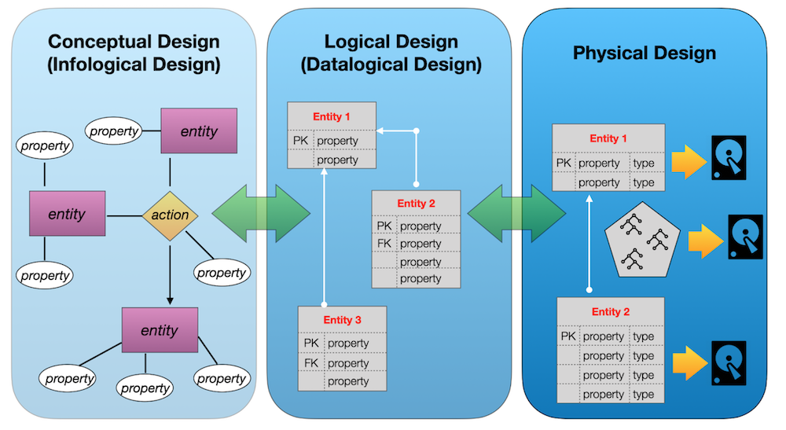

# D06 SQL
Resume: Today you will see how to add a new business feature into our data model.

## Theory

Why is a diamond one of the most durable objects? The reason lies in its structure. Each atom knows its place in the topology of the diamond and makes the whole diamond unbreakable. 

A logical structure is like a diamond. If you find a suitable structure for your own Database Model, you will find gold (or diamond :-). There are two aspects to Database Modeling. The first is a logical view, in other words, how your model will smoothly describe the real business world.

On the other hand, your model should solve your functional tasks with minimal impact. This means transforming the logical model view into the physical model view, and not just from table and attribute descriptions. But actually, from performance and budget perspectives, which are more important today. How to find a balance? For this case, there are 3 steps to create a very good design. Just take a look at the image below.

## Rules of the day

|Check| Condition|
|---|---|
|✔|Please make sure you have your own database and access for it on your PostgreSQL cluster. |
|✔|Please download a [script](../materials/model.sql) with Database Model here and apply the script to your database (you can use command line with psql or just run it through any IDE, for example DataGrip from JetBrains or pgAdmin from PostgreSQL community). **Our knowledge way is incremental and linear therefore please be aware that all changes you made in Day03 during Exercises 07-13 and in Day04 during Exercise 07 should be on place (its similar like in real world when we applied a release and need to be consistent with data for new changes).**|
|✔|All tasks contain a list of Allowed and Denied sections with listed database options, database types, SQL constructions etc. Please have a look at this section before you start.|
|✔|Please take a look at the Logical View of our Database Model. |

## DB Structure

|Table|Columns|
|---|---|
|**pizzeria** table (Dictionary Table with available pizzerias)|id — primary key  name — name of pizzeria  rating — average rating of pizzeria (from 0 to 5 points)|
|**person** table (Dictionary Table with persons who loves pizza)|id — primary key  name — name of person  age — age of person  gender — gender of person  address — address of person|
|**menu** table (Dictionary Table with available menu and price for concrete pizza)|id — primary key  pizzeria_id — foreign key to pizzeria  pizza_name — name of pizza in pizzeria  price — price of concrete pizza|
|**person_visits** table (Operational Table with information about visits of pizzeria)|id — primary key  person_id — foreign key to person  pizzeria_id — foreign key to pizzeria  visit_date — date (for example 2022-01-01) of person visit |
|**person_order** table (Operational Table with information about persons orders)|id — primary key  person_id — foreign key to person  menu_id — foreign key to menu  order_date — date (for example 2022-01-01) of person order |

* People's visit and people's order are different entities and don't contain any correlation between data. For example, a customer can be in a restaurant (just looking at the menu) and in that time place an order in another restaurant by phone or mobile application. Or another case, just be at home and again make a call with order without any visits.

## Tasks

|Check|Point|
|---|---|
|✔|Exercise 00|
|✔|Exercise 01|
|✔|Exercise 02|
|✔|Exercise 03|
|✔|Exercise 04|
|✔|Exercise 05|
|✔|Exercise 06|

### Exercise 00 — Discounts, discounts , everyone loves discounts

| Exercise 00: Discounts, discounts , everyone loves discounts ||
|---|---|
| Turn-in directory | ex00 |
| Files to turn-in| `day06_ex00.sql` |
| **Allowed** ||
| Language| SQL, DML, DDL|

Let's add a new business feature to our data model.
Every person wants to see a personal discount and every business wants to be closer for customers.
Think about personal discounts for people from one side and pizza restaurants from the other. 

1. Need to create a new relational table (please set a name `person_discounts`) with the following rules:
    1.1. Set **id** attribute like a Primary Key (please have a look at id column in existing tables and choose the same data type).
    1.2. Set attributes **person_id** and **pizzeria_id** as foreign keys for corresponding tables (data types should be the same as for id columns in corresponding parent tables).
    1.3. Please set explicit names for foreign key constraints using the pattern fk_{table_name}_{column_name}, for example `fk_person_discounts_person_id`.
    1.4. Add a **discount** attribute to store a discount value **in percent**. Remember that the discount value can be a floating-point number (just use the `numeric` datatype). So please choose the appropriate datatype to cover this possibility.

### Exercise 01 — Let’s set personal discounts

| Exercise 01: Let’s set personal discounts||
|---|---|
| Turn-in directory | ex01 |
| Files to turn-in| `day06_ex01.sql` |
| **Allowed** ||
| Language| SQL, DML, DDL|

Actually, we have created a structure to store our discounts and we are ready to go further and fill our `person_discounts` table with new records.

So, there is a table `person_order` which stores the history of a person's orders. Please write a DML statement (`INSERT INTO ... SELECT ...`) that makes inserts new records into the `person_discounts` table based on the following rules.
1. Take aggregated state from person_id and pizzeria_id columns.
2. Calculate personal discount value by the next pseudo code:

    `if “amount of orders” = 1 then
    “discount” = 10.5 
    else if “amount of orders” = 2 then 
    “discount” = 22
    else 
    “discount” = 30`

3. To create a primary key for the person_discounts table, use the following SQL construct (this construct is from the WINDOW FUNCTION SQL section).
    `... ROW_NUMBER( ) OVER ( ) AS id ...`

### Exercise 02 — Let’s recalculate a history of orders

| Exercise 02: Let’s recalculate a history of orders||
|---|---|
| Turn-in directory | ex02 |
| Files to turn-in| `day06_ex02.sql` |
| **Allowed** ||
| Language| SQL, DML, DDL|

Write a SQL statement that returns the orders with actual price and price with discount applied for each person in the corresponding pizzeria restaurant, **sorted by person name and pizza name**. Please see the sample data below.

| name | pizza_name | price | discount_price | pizzeria_name | 
| --- | --- | --- | --- | --- |
| Andrey | cheese pizza | 800 | 624 | Dominos |
| Andrey | mushroom pizza | 1100 | 858 | Dominos |
| ... | ... | ... | ... | ... |

### Exercise 03 — Improvements are in a way

| Exercise 03: Improvements are in a way ||
|---|---|
| Turn-in directory | ex03 |
| Files to turn-in| `day06_ex03.sql` |
| **Allowed** ||
| Language| SQL, DML, DDL|

Actually, we need to improve data consistency from one side and performance tuning from the other side. Please create a multi-column unique index (named `idx_person_discounts_unique`) that prevents duplicates of the **person and pizzeria identifier** pairs.

After creating a new index, please provide any simple SQL statement that shows proof of the index usage (using `EXPLAIN ANALYZE`).
The proof example is below:

...
Index Scan using idx_person_discounts_unique on person_discounts
...

### Exercise 04 — We need more Data Consistency

| Exercise 04: We need more Data Consistency ||
|---|---|
| Turn-in directory | ex04 |
| Files to turn-in| `day06_ex04.sql` |
| **Allowed** ||
| Language| SQL, DML, DDL|

Please add the following constraint rules for existing columns of the `person_discounts` table:
||||
|---|---|---|
|✔|person_id column should not be NULL| (use constraint name `ch_nn_person_id`)|
|✔|pizzeria_id column should not be NULL| (use constraint name `ch_nn_pizzeria_id`)|
|✔|discount column should not be NULL| (use constraint name `ch_nn_discount`)|
|✔|discount column should be 0 percent by default||
|✔|discount column should be in a range values from 0 to 100 |(use constraint name `ch_range_discount`)|

### Exercise 05 — Data Governance Rules

| Exercise 05: Data Governance Rules||
|---|---|
| Turn-in directory | ex05 |
| Files to turn-in| `day06_ex05.sql` |
| **Allowed** ||
| Language|SQL, DML, DDL|

To comply with Data Governance Policies, you need to add comments for the table and the table's columns. Let's apply this policy to the `person_discounts` table. Please add English or Russian comments (it is up to you) explaining what is a business goal of a table and all its attributes.

### Exercise 06 — Let’s automate Primary Key generation

| Exercise 06: Let’s automate Primary Key generation||
|---|---|
| Turn-in directory | ex06 |
| Files to turn-in| `day06_ex06.sql` |
| **Allowed** ||
| Language| SQL, DML, DDL|
| **Denied** ||
| SQL Syntax Pattern| Don’t use hard-coded value for amount of rows to set a right value for sequence|

1. Let’s create a Database Sequence named `seq_person_discounts` (starting with a value of 1).
2. Set a default value for the id attribute of the `person_discounts` table to automatically take a value from `seq_person_discounts` each time. 
* Please note that your next sequence number is 1, in this case please set an active value for database sequence based on formula "number of rows in person_discounts table" + 1. Otherwise you will get errors about Primary Key violation constraint.

