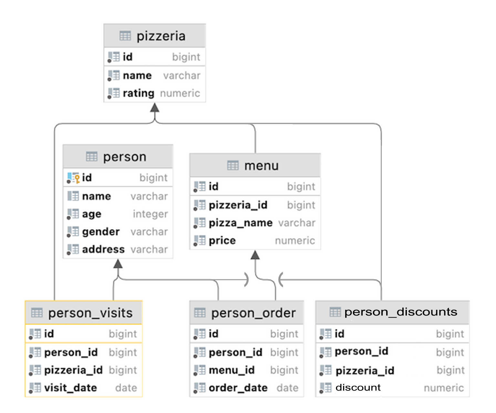

# D07 SQL
Resume: Today you will see how to use specific OLAP constructions to get a "Value" from data.

## Theory

For detailed data over time, see the Curve of Usefulness. In other words, detailed data (i.e. user transactions, facts about products and providers, etc.) is not useful to us from a historical perspective, because we only need to know some aggregation to describe what was going on a year ago.

## Rules of the day

|Check| Condition|
|---|---|
|✔|Please make sure you have your own database and access for it on your PostgreSQL cluster. |
|✔|Please download a [script](../materials/model.sql) with Database Model here and apply the script to your database (you can use command line with psql or just run it through any IDE, for example DataGrip from JetBrains or pgAdmin from PostgreSQL community). **Our knowledge way is incremental and linear therefore please be aware that all changes you made in Day03 during Exercises 07-13, in Day04 during Exercise 07, in Day06 should be in place (its similar like in real world when we applied a release and need to be consistent with data for new changes).**|
|✔|All tasks contain a list of Allowed and Denied sections with listed database options, database types, SQL constructions etc. Please have a look at this section before you start.|
|✔|Please take a look at the Logical View of our Database Model. |

## DB Structure

|Table|Columns|
|---|---|
|**pizzeria** table (Dictionary Table with available pizzerias)|id — primary key  name — name of pizzeria  rating — average rating of pizzeria (from 0 to 5 points)|
|**person** table (Dictionary Table with persons who loves pizza)|id — primary key  name — name of person  age — age of person  gender — gender of person  address — address of person|
|**menu** table (Dictionary Table with available menu and price for concrete pizza)|id — primary key  pizzeria_id — foreign key to pizzeria  pizza_name — name of pizza in pizzeria  price — price of concrete pizza|
|**person_visits** table (Operational Table with information about visits of pizzeria)|id — primary key  person_id — foreign key to person  pizzeria_id — foreign key to pizzeria  visit_date — date (for example 2022-01-01) of person visit |
|**person_order** table (Operational Table with information about persons orders)|id — primary key  person_id — foreign key to person  menu_id — foreign key to menu  order_date — date (for example 2022-01-01) of person order |
|**person_discounts** table (Operational Table that contains personal discounts of people included in the DB)|id — primary key  person_id — foreign key to person  pizzeria_id  — foreign key to pizzeria  discount — information about personal discounts in percent form |

* People's visit and people's order are different entities and don't contain any correlation between data. For example, a customer can be in a restaurant (just looking at the menu) and in that time place an order in another restaurant by phone or mobile application. Or another case, just be at home and again make a call with order without any visits.

## Tasks

|Check|Point|
|---|---|
|✔|Exercise 00|
|✔|Exercise 01|
|✔|Exercise 02|
|✔|Exercise 03|
|✔|Exercise 04|
|✔|Exercise 05|
|✔|Exercise 06|
|✔|Exercise 07|
|✔|Exercise 08|
|✔|Exercise 09|

### Exercise 00 — Simple aggregated information

| Exercise 00: Simple aggregated information ||
|---|---|
| Turn-in directory | ex00 |
| Files to turn-in| `day07_ex00.sql` |
| **Allowed** ||
| Language| ANSI SQL|

Let's make a simple aggregation, please write a SQL statement that returns person identifiers and corresponding number of visits in any pizzerias and sorts by number of visits in descending mode and sorts by `person_id` in ascending mode. Please take a look at the sample of data below.

| person_id | count_of_visits |
| --- | --- |
| 9 | 4 |
| 4 | 3 |
| ... | ... | 

### Exercise 01 — Let’s see real names

| Exercise 01: Let’s see real names||
|---|---|
| Turn-in directory | ex01 |
| Files to turn-in| `day07_ex01.sql` |
| **Allowed** ||
| Language| ANSI SQL|

1) Please modify an SQL statement from Exercise 00 and return a person name (not an identifier). 
2) Additional clause is we need to see only top 4 people with maximum visits in all  pizzerias together and sorted the same way.
* See the example of output data below.
    | name | count_of_visits |
    | --- | --- |
    | Dmitriy | 4 |
    | Denis | 3 |
    | ... | ... | 

### Exercise 02 — Restaurants statistics

| Exercise 02: Restaurants statistics||
|---|---|
| Turn-in directory | ex02 |
| Files to turn-in| `day07_ex02.sql` |
| **Allowed** ||
| Language| ANSI SQL|

1) Please write a SQL statement to see **3 favorite restaurants** **by visits and by orders** (6 total) in a list (please add an **action_type column** with values **'order' or 'visit'**, it depends on the data from the corresponding table). Please have a look at the example data below. 
2) The result should be sorted in ascending order by the action_type column and in descending order by the count column.

| name | count | action_type |
| --- | --- | --- |
| Dominos | 6 | order |
| ... | ... | ... |
| Dominos | 7 | visit |
| ... | ... | ... |

### Exercise 03 — Restaurants statistics #2

| Exercise 03: Restaurants statistics #2 ||
|---|---|
| Turn-in directory | ex03 |
| Files to turn-in| `day07_ex03.sql` |
| **Allowed** ||
| Language| ANSI SQL|

1) Write an SQL statement to see how restaurants are grouped by visits and by orders, and joined together by restaurant name.
You can use the internal SQL from Exercise 02 (Restaurants by Visits and by Orders) **without any restrictions on the number of rows**.

In addition, add the following rules.
2) Compute a sum of orders and visits for the corresponding pizzeria (note that not all pizzeria keys are represented in both tables).
3) Sort the results by the `total_count` column in descending order and by the `name` column in ascending order.
Take a look at the example data below.

| name | total_count |
| --- | --- |
| Dominos | 13 |
| DinoPizza | 9 |
| ... | ... | 

### Exercise 04 — Clause for groups

| Exercise 04: Clause for groups ||
|---|---|
| Turn-in directory | ex04 |
| Files to turn-in| `day07_ex04.sql` |
| **Allowed** ||
| Language| ANSI SQL|
| **Denied** ||
| Syntax construction| `WHERE`|

Please write a SQL statement that returns the **person's name** and the corresponding **number of visits** to any pizzerias if the person has visited **more than 3 times** (> 3). Please take a look at the sample data below.

| name | count_of_visits |
| --- | --- |
| Dmitriy | 4 |

### Exercise 05 — Person's uniqueness

| Exercise 05: Person's uniqueness||
|---|---|
| Turn-in directory | ex05 |
| Files to turn-in| `day07_ex05.sql` |
| **Allowed** ||
| Language|ANSI SQL|
| **Denied** ||
| Syntax construction|**`GROUP BY`, any type (`UNION`,...) working with sets**|

1) Please write a simple SQL query that returns a list of **unique person names** who have **placed orders** at any pizzerias. 
2) The result should be sorted by person name. Please see the example below.

| name | 
| --- |
| Andrey |
| Anna | 
| ... | 

### Exercise 06 — Restaurant metrics

| Exercise 06: Restaurant metrics||
|---|---|
| Turn-in directory | ex06 |
| Files to turn-in| `day07_ex06.sql` |
| **Allowed** ||
| Language| ANSI SQL|

1) Please write a SQL statement that returns the **number of orders**, **the average price**, **the maximum price** and **the minimum price** for pizzas sold by **each pizzeria restaurant**. 
2) The result should be sorted by pizzeria name. See the sample data below. 
3) Round the average price to 2 floating numbers.

| name | count_of_orders | average_price | max_price | min_price |
| --- | --- | --- | --- | --- |
| Best Pizza | 5 | 780 | 850 | 700 |
| DinoPizza | 5 | 880 | 1000 | 800 |
| ... | ... | ... | ... | ... |

### Exercise 07 — Average global rating

| Exercise 07: Average global rating||
|---|---|
| Turn-in directory | ex07 |
| Files to turn-in| `day07_ex07.sql` |
| **Allowed** ||
| Language| ANSI SQL|

1. Write an SQL statement that returns a **common average rating** (the output attribute name is **global_rating**) **for all restaurants**. 
2. Round your average rating to 4 floating point numbers.

### Exercise 08 — Find pizzeria’s restaurant locations

| Exercise 08: Find pizzeria’s restaurant locations||
|---|---|
| Turn-in directory | ex08 |
| Files to turn-in| `day07_ex08.sql` |
| **Allowed** ||
| Language| ANSI SQL|

We know personal addresses from our data. Let's assume that this person only visits pizzerias in his city. 
1) Write a SQL statement that returns the **address**, the **name of the pizzeria**, and the **amount of the person's orders**. 
2) The result should be **sorted** by **address** and then by **restaurant name**. 
* Please take a look at the sample output data below.
    | address | name |count_of_orders |
    | --- | --- |--- |
    | Kazan | Best Pizza |4 |
    | Kazan | DinoPizza |4 |
    | ... | ... | ... | 

### Exercise 09 — Explicit type transformation

| Exercise 09: Explicit type transformation||
|---|---|
| Turn-in directory | ex09 |
| Files to turn-in| `day07_ex09.sql` |
| **Allowed** ||
| Language| ANSI SQL|

1. Please write a SQL statement that returns aggregated information by **person's address**, the result of **"Maximum Age - (Minimum Age / Maximum Age)"** presented as a **formula** column, next is **average age per address** and the result of **comparison between formula** and average columns (in other words, **if formula is greater than average, then True**, **otherwise False** value).

2. The result should be sorted by address column. Please take a look at the example of output data below.

| address | formula |average | comparison |
| --- | --- |--- |--- |
| Kazan | 44.71 |30.33 | true |
| Moscow | 20.24 | 18.5 | true |
| ... | ... | ... | ... |

