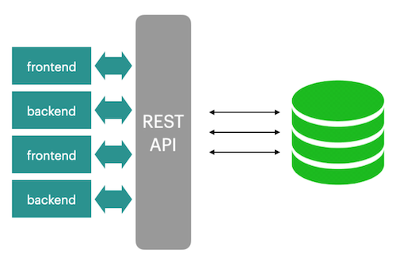
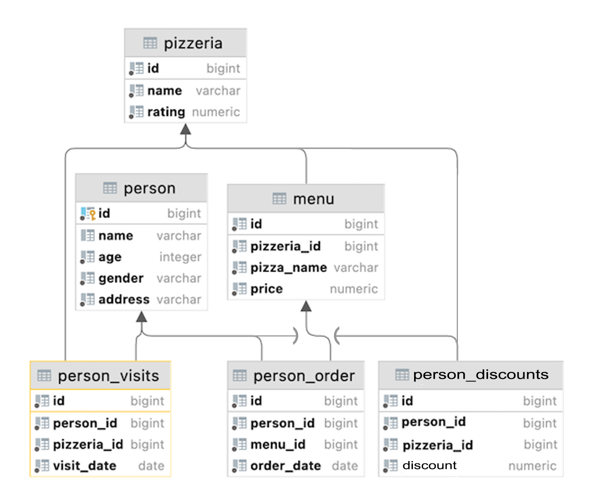

# D09 SQL 

Resume: Today you will see how to create and use functional blocks in Databases.

## Theory

There are many functional programming languages in the RDBMS world. We can mainly talk about a "one-to-one" dependency between a particular RDBMS engine and the functional language inside it. Please take a look at a sample of these languages:
- T-SQL,
- PL/SQL,
- SQL,
- PL/PGSQL,
- PL/R,
- PL/Python,
- etc.

Actually, there are two opposing opinions in the IT world about where business logic should be located. The first opinion is on Application Level, the second one is in RDBMS directly based on set UDF (User Defined Functions / Procedures / Packages). 
Everyone chooses their own way to implement business logic. From our point of view, business logic should be in both places and we can tell you why.  
Please take a look at the 2 simple architectures below. 

|  |  |
| ------ | ------ |
|  | Everything is clear, frontends and backends work through a special REST API layer that implements all the business logic. It's a really ideal application world. |
| But there are always some privileged people / applications (like IDE) that work directly with our databases and... our pattern can be broken. |  |


## Rules of the day

|Check| Condition|
|---|---|
|✔|Please make sure you have your own database and access for it on your PostgreSQL cluster. |
|✔|Please download a [script](../materials/model.sql) with Database Model here and apply the script to your database (you can use command line with psql or just run it through any IDE, for example DataGrip from JetBrains or pgAdmin from PostgreSQL community). **Our knowledge way is incremental and linear therefore please be aware that all changes you made in Day03 during Exercises 07-13, in Day04 during Exercise 07, in Day06 should be in place (its similar like in real world when we applied a release and need to be consistent with data for new changes).**|
|✔|All tasks contain a list of Allowed and Denied sections with listed database options, database types, SQL constructions etc. Please have a look at this section before you start.|
|✔|Please take a look at the Logical View of our Database Model. |


## DB Structure



|Table|Columns|
|---|---|
|**pizzeria** table (Dictionary Table with available pizzerias)|id — primary key <br>name — name of pizzeria <br>rating — average rating of pizzeria (from 0 to 5 points)|
|**person** table (Dictionary Table with persons who loves pizza)|id — primary key <br>name — name of person <br>age — age of person <br>gender — gender of person <br>address — address of person|
|**menu** table (Dictionary Table with available menu and price for concrete pizza)|id — primary key <br>pizzeria_id — foreign key to pizzeria <br>pizza_name — name of pizza in pizzeria <br>price — price of concrete pizza|
|**person_visits** table (Operational Table with information about visits of pizzeria)|id — primary key <br>person_id — foreign key to person <br>pizzeria_id — foreign key to pizzeria <br>visit_date — date (for example 2022-01-01) of person visit |
|**person_order** table (Operational Table with information about persons orders)|id — primary key <br>person_id — foreign key to person <br>menu_id — foreign key to menu <br>order_date — date (for example 2022-01-01) of person order |
|**person_discounts** table (Operational Table that contains personal discounts of people included in the DB)|id — primary key <br>person_id — foreign key to person <br>pizzeria_id— foreign key to pizzeria <br>discount — information about personal discounts in percent form |


* People's visit and people's order are different entities and don't contain any correlation between data. For example, a customer can be in a restaurant (just looking at the menu) and in that time place an order in another restaurant by phone or mobile application. Or another case, just be at home and again make a call with order without any visits.


## Tasks

|Check|Point|
|---|---|
|✔|Exercise 00|
|✔|Exercise 01|
|✔|Exercise 02|
|✔|Exercise 03|
|✔|Exercise 04|
|✔|Exercise 05|
|✔|Exercise 06|
|✔|Exercise 07|
|✔|Exercise 08|


## Exercise 00 — Audit of incoming inserts

| Exercise 00: Audit of incoming inserts ||
|---|---|
| Turn-in directory | ex00 |
| Files to turn-in| `day09_ex00.sql`|
| **Allowed** ||
| Language| SQL, DDL, DML|

We want to be stronger with data, and we don't want to lose any change events. Let's implement an audit function for the incoming changes of INSERT. 
1) Please create a table `person_audit` with the same structure as a person table, but please add some additional changes. Take a look at the table below with descriptions for each column.
    | Column | Type | Description |
    | --- | --- | --- |
    | created | timestamp with time zone | timestamp when a new event has been created.Default value is a current timestamp and NOT NULL |
    | type_event | char(1) | possible values I (insert), D (delete), U (update). Default value is ‘I’. NOT NULL. Add check constraint `ch_type_event` with possible values ‘I’, ‘U’ and ‘D’ |
    | row_id |bigint | copy of person.id. NOT NULL |
    | name |varchar | copy of person.name (no any constraints) |
    | age |integer | copy of person.age (no any constraints) |
    | gender |varchar | copy of person.gender (no any constraints) |
    | address |varchar | copy of person.address (no any constraints) |

2) Actually, let’s create a Database Trigger Function with the name `fnc_trg_person_insert_audit` that should process `INSERT` DML traffic and make a copy of a **new row** in the person_audit table.

* Just a hint, if you want to implement a PostgreSQL trigger (please read it in PostgreSQL documentation), you need to create 2 objects: Database Trigger Function and Database Trigger. 

3) So, please define a Database Trigger with the name `trg_person_insert_audit` with the following options:
    - trigger with "FOR EACH ROW" option;
    - trigger with "AFTER INSERT";
    - trigger calls fnc_trg_person_insert_audit trigger function.

4) When you are done with the trigger objects, please issue an `INSERT` statement into the person table. 
`INSERT INTO person(id, name, age, gender, address) VALUES (10,'Damir', 22, 'male', 'Irkutsk');`


## Exercise 01 — Audit of incoming updates

| Exercise 01: Audit of incoming updates||
|---|---|
| Turn-in directory | ex01 |
| Files to turn-in| `day09_ex01.sql` |
| **Allowed** ||
| Language| SQL, DDL, DML|

Let’s continue to implement our audit pattern for the person table. 

1) Define a trigger `trg_person_update_audit` and corresponding trigger function `fnc_trg_person_update_audit` to handle all `UPDATE` traffic on the person table. We should save the **OLD states of all attribute values**.

2) When you are ready, apply the UPDATE statements below.
    `UPDATE person SET name = 'Bulat' WHERE id = 10;`
    `UPDATE person SET name = 'Damir' WHERE id = 10;`


## Exercise 02 — Audit of incoming deletes

| Exercise 02: Audit of incoming deletes||
|---|---|
| Turn-in directory | ex02 |
| Files to turn-in| `day09_ex02.sql` |
| **Allowed** ||
| Language| SQL, DDL, DML|

Finally, we need to handle `DELETE` statements and make a copy of the **OLD states** for all attribute’s values.
1) Please create a trigger `trg_person_delete_audit` and corresponding trigger function `fnc_trg_person_delete_audit`. 

2) When you are ready, use the SQL statement below.
    `DELETE FROM person WHERE id = 10;`


## Exercise 03 — Generic Audit

| Exercise 03: Generic Audit ||
|---|---|
| Turn-in directory | ex03 |
| Files to turn-in| `day09_ex03.sql` |
| **Allowed** ||
| Language| SQL, DDL, DML|

Actually, there are 3 triggers for one `person` table. 

1) Let's merge all our logic into one main trigger called `trg_person_audit` and a new corresponding trigger function `fnc_trg_person_audit`.In other words, all DML traffic (`INSERT`, `UPDATE`, `DELETE`) should be handled by the one function block. Please explicitly define a **separate IF-ELSE block** for each event (I, U, D)!

2) Additionally, please follow the steps below .
    - to remove 3 old triggers from the person table;
    - to remove 3 old trigger functions;
    - to do a `TRUNCATE` (or `DELETE`) of all rows in our `person_audit` table.

3) When you are ready, reapply the set of DML statements.
    `INSERT INTO person(id, name, age, gender, address)VALUES (10,'Damir', 22, 'male', 'Irkutsk');`
    `UPDATE person SET name = 'Bulat' WHERE id = 10;`
    `UPDATE person SET name = 'Damir' WHERE id = 10;`
    `DELETE FROM person WHERE id = 10;`


## Exercise 04 — Database View VS Database Function

| Exercise 04: Database View VS Database Function ||
|---|---|
| Turn-in directory | ex04 |
| Files to turn-in| `day09_ex04.sql` |
| **Allowed** ||
| Language| SQL, DDL, DML|

As you recall, we created 2 database views to separate data from the person tables by gender attribute. 

1) Please define 2 SQL functions (note, not **pl/pgsql functions**) with the names:
    - `fnc_persons_female` (should return female persons),
    - `fnc_persons_male` (should return male persons).

To check yourself and call a function, you can make a statement like this (Amazing! You can work with a function like a virtual table!):
    SELECT *
    FROM fnc_persons_male();
    SELECT *
    FROM fnc_persons_female();


## Exercise 05 — Parameterized Database Function

| Exercise 05: Parameterized Database Function||
|---|---|
| Turn-in directory | ex05 |
| Files to turn-in| `day09_ex05.sql` |
| **Allowed** ||
| Language|SQL, DDL, DML |

1) Looks like 2 functions from Exercise 04 need a more generic approach. Please remove these functions from the database before proceeding. 
2) Write a generic SQL function (note, not pl/pgsql-function) called `fnc_persons`. This function should have an `IN` parameter pgender with the default value = 'female'. 

3) To check yourself and call a function, you can make a statement like this (Wow! You can work with a function like with a virtual table, but with more flexibility!):
    select *
    from fnc_persons(pgender := 'male');
    select *
    from fnc_persons();


## Exercise 06 — Function like a function-wrapper

| Exercise 06: Function like a function-wrapper||
|---|---|
| Turn-in directory | ex06 |
| Files to turn-in| `day09_ex06.sql` |
| **Allowed** ||
| Language| SQL, DDL, DML|

Now let's look at pl/pgsql functions. 

1) Please create a pl/pgsql function `fnc_person_visits_and_eats_on_date` based on an SQL statement that will find the names of pizzerias that a person (`IN` pperson parameter with default value 'Dmitriy') visited and where he **could** buy pizza for less than the given amount in rubles (`IN` pprice parameter with default value 500) on the given date (`IN` pdate parameter with default value January 8, 2022).

2) To check yourself and call a function, you can make a statement like the one below.
    select *
    from fnc_person_visits_and_eats_on_date(pprice := 800);
    select *
    from fnc_person_visits_and_eats_on_date(pperson := 'Anna',pprice := 1300,pdate := '2022-01-01');


## Exercise 07 — Different view to find a Minimum

| Exercise 07: Different view to find a Minimum||
|---|---|
| Turn-in directory | ex07 |
| Files to turn-in| `day09_ex07.sql` |
| **Allowed** ||
| Language| SQL, DDL, DML|

1) Please write an SQL or pl/pgsql function `func_minimum` (it is up to you) that has an input parameter that is an array of numbers and the function should return a minimum value. 

2) To check yourself and call a function, you can make a statement like the one below.
    `SELECT func_minimum(VARIADIC arr => ARRAY[10.0, -1.0, 5.0, 4.4]);`


## Exercise 08 — Fibonacci algorithm is in a function

| Exercise 08: Fibonacci algorithm is in a function||
|---|---|
| Turn-in directory | ex08 |
| Files to turn-in| `day09_ex08.sql` |
| **Allowed** ||
| Language| SQL, DDL, DML|

1) Write an SQL or pl/pgsql function `fnc_fibonacci` (it's up to you) that has an input parameter **pstop** of type integer (default is 10) and the function output is a table of all **Fibonacci numbers less than pstop**.

2) To check yourself and call a function, you can make a statement like the one below.
    ```
    select * from fnc_fibonacci(100);
    select * from fnc_fibonacci();
    ```

