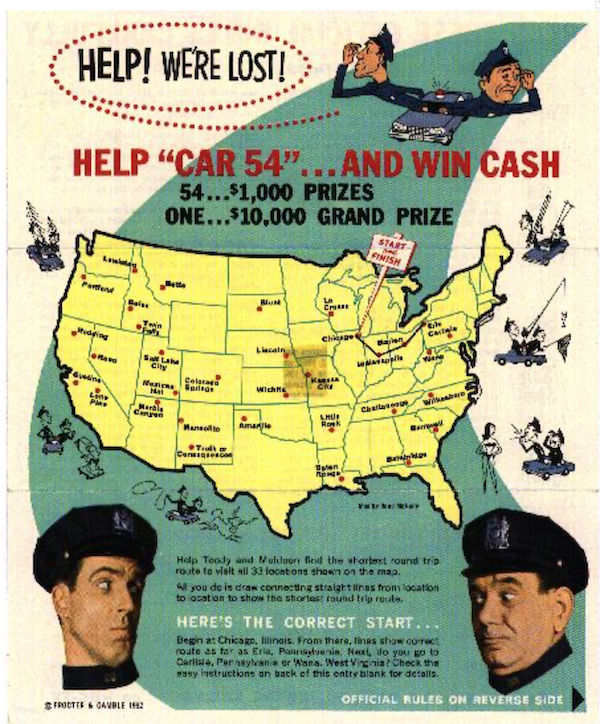
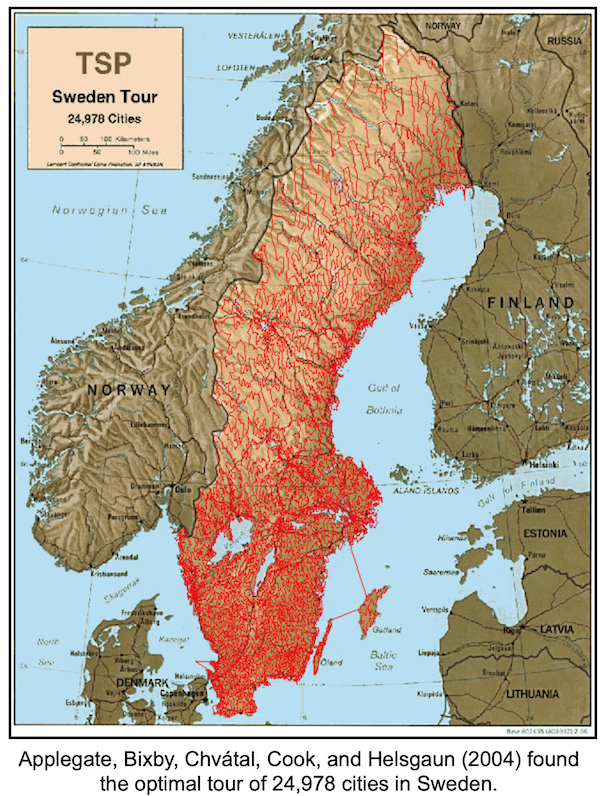
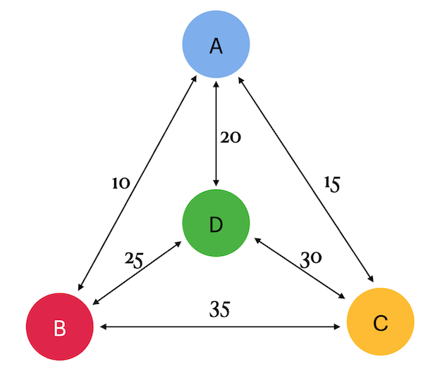

# T00 SQL - _Traveling Salesman Problem_

## Theory

Given a finite number of "cities" and the cost of travel between each pair of cities, find the cheapest way to visit all the cities and return to your starting point. (In the picture, the Proctor and Gamble company held a contest in 1962.  The contest required solving a TSP for a given set of 33 cities.  There was a tie between many people who found the optimum.  An early TSP researcher, Professor Gerald Thompson of Carnegie Mellon University, was one of the winners).

The travel costs are symmetric in the sense that traveling from city X to city Y costs as much as traveling from Y to X; the "way to visit all the cities" is simply the order in which the cities are visited. In other words, the data consists of integer weights assigned to the edges of a finite complete graph; the goal is to find a Hamiltonian cycle (i.e., a cycle that passes through all vertices) with the minimum total weight.  In this context, Hamiltonian cycles are commonly called tours.

The origins of the TSP are unclear. In the 1920s, the mathematician and economist Karl Menger published it among his colleagues in Vienna. In the 1930s, the problem resurfaced in mathematical circles in Princeton. In the 1940s, it was studied by statisticians (Mahalanobis (1940), Jessen (1942), Gosh (1948), Marks (1948)) in connection with an agricultural application, and the mathematician Merill Flood popularized it among his colleagues at the RAND Corporation.  Eventually, the TSP became known as the prototype of a hard problem in combinatorial optimization: examining the tours one by one is out of the question due to their large number, and for a long time there was no other idea on the horizon.

## Rules of the day

|Check| Condition|
|---|---|
|✔|Please make sure you have your own database and access for it on your PostgreSQL cluster. |
|✔|All tasks contain a list of Allowed and Denied sections with listed database options, database types, SQL constructions etc. Please have a look at this section before you start.|

## Tasks

|Done|Check|Point|
|---|---|---|
|✔|✔|Exercise 00|
|✔|✔|Exercise 01|

### Exercise 00 — Classical TSP

| Exercise 00: Classical TSP||
|----|---|
| Turn-in directory| ex00|
| Files to turn-in | `team00_ex00.sql` DDL for table creation with INSERTs of data; SQL DML statement|
| **Allowed**||
| Language| ANSI SQL|
| SQL Syntax Pattern| Recursive Query|

* Take a look at the Graph. 
    * There are 4 cities (a, b, c and d) and arcs between them with costs (or taxes). 
    * Actually, the cost is (a,b) = (b,a).

1. Please create a table with named nodes using structure **{point1, point2, cost}** and fill data based on a picture (remember **there are direct and reverse paths** between 2 nodes).
2. Please write a SQL statement that returns all tours (aka paths) **with minimum travel cost** if we **start from city "a"**.
Remember, you need to find the ***cheapest way to visit all cities and return to your starting point***. For example, the tour looks like a -> b -> c -> d -> a. Please **sort the data by total_cost and then by tour**.

* Below is an example of the output data. 
    | total_cost | tour |
    | ------ | ------ |
    | 80 | {a,b,d,c,a} |
    | ... | ... |

### Exercise 01 — Opposite TSP

| Exercise 01: Opposite TSP||
|----|---|
| Turn-in directory| ex01|
| Files to turn-in | `team00_ex01.sql`SQL DML statement  |
| **Allowed**||
| Language| ANSI SQL|
| SQL Syntax Pattern| Recursive Query|

1) Please add a way to see additional rows with the **most expensive cost** to the SQL **from the previous exercise**. Please **sort the data by total_cost and then by trip**.

* Take a look at the sample data below. 

| total_cost | tour |
| ------ | ------ |
| 80 | {a,b,d,c,a} |
| ... | ... |
| 95 | {a,d,c,b,a} |

